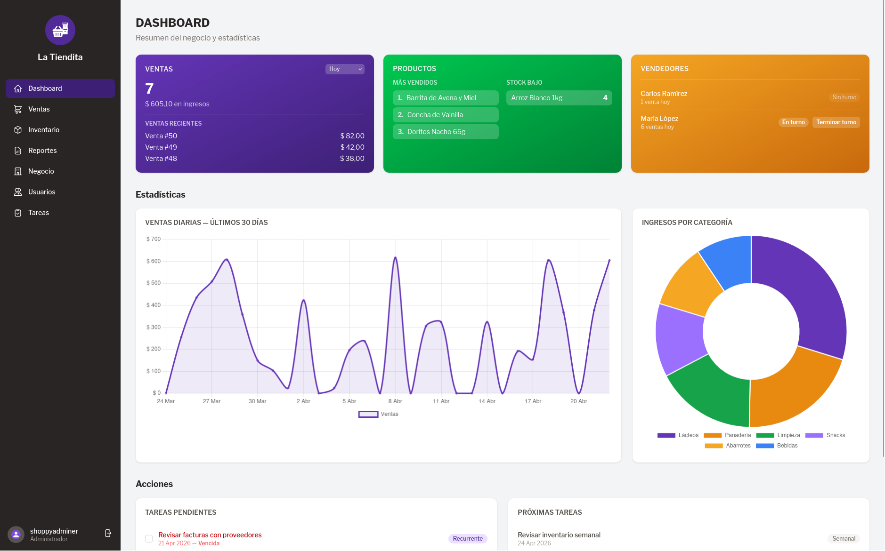

#  Shoppy: POS & Inventory System


A Laravel-based Point of Sale and inventory management system designed for small local businesses. Built with simplicity in mind.




## Demo
**:rocket: Live Demo:** https://shoppy-sales.up.railway.app/

### Credentials

| User                  | Password |
|-----------------------|----------|
| adminer@shoppy.local  | 1234     |
| maria@shoppy.local    | 1234     |


## Features

### Shoppy Adminer (Admin Panel)
- Dashboard with sales overview
- Inventory management (CRUD)
- Sales reports and analytics
- Business settings and configuration
- User management
- Financial tracking

### Shoppy Sales (POS Terminal)
- Fast, touch-friendly checkout interface
- Product search and selection
- Real-time sales processing
- Optimized for sellers

## Installation

```bash
# Install dependencies
composer install

# Setup environment
cp .env.example .env
php artisan key:generate

# Database setup
php artisan migrate
php artisan db:seed

# Run development server
php artisan serve
```

## Tech Stack

- **Backend**: PHP 8.x + Laravel 11
- **Database**: MySQL
- **Frontend**: Blade templates + TailwindCSS
- **Authentication**: Laravel Breeze
- **Language**: Spanish (UI)

## Architecture

- Admin routes: `/admin` (role-based middleware)
- POS routes: `/pos` (seller access)
- Service-oriented for complex logic

## Testing

```bash
php artisan test
```

Tests organized in:
- `tests/Feature/Shoppy_Adminer/`
- `tests/Feature/Shoppy_Sales/`
